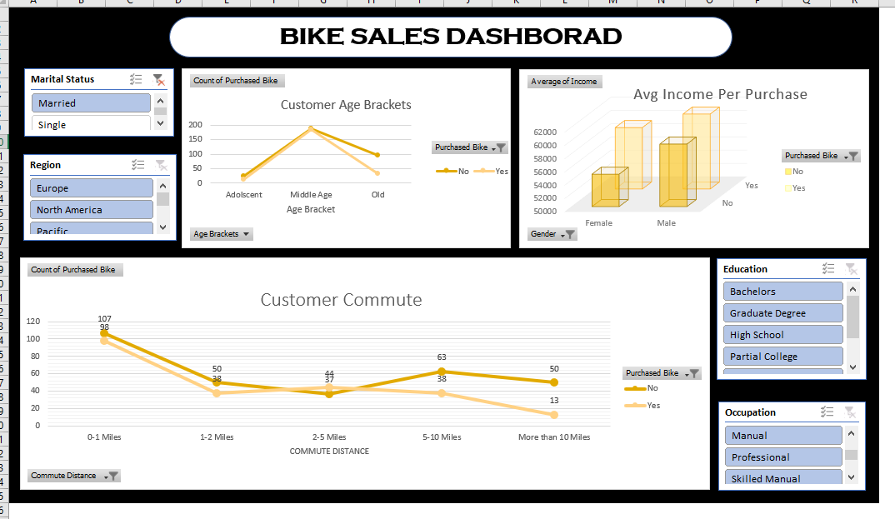

# 🚴 Bike Sales Dashboard  

## 📌 Project Overview  
This project showcases **Bike Sales Data Analysis** using Microsoft Excel.  
It covers the full data journey — from **raw dataset cleaning** to creating a **professional dashboard** for insights.  

---
## 📊 Dashboard Preview
    
### Main Dashboard

---

## 📂 File Structure  

### 1. **bike_buyers (Raw Data)**  
- Original dataset containing customer demographics, income, commute distance, and bike purchase details.  

### 2. **Working Sheet (Data Cleaning)**  
- Removed duplicates and blanks  
- Standardized categorical values (e.g., "M" → "Male")  
- Corrected inconsistencies in data entries  
- Added calculated fields (Age brackets, commute groups, etc.)  

### 3. **pivot table (Analysis Layer)**  
- Built pivot tables for different dimensions:  
  - Income vs Bike Purchase  
  - Age Brackets vs Bike Purchase  
  - Commute Distance impact  
  - Gender/Marital Status/Region impact  
- Summarized key patterns for dashboard usage  

### 4. **dashborad (Visualization)**  
- Final dashboard with interactive filters (Slicers)  
- **Key KPIs:**  
  - Average Income per Purchase Status  
  - Commute Distance Distribution  
  - Age Group Analysis  
  - Gender-based Purchase Trends  

---

## 📊 Key Insights  
- Higher income groups are **more likely** to purchase bikes  
- **Middle-aged groups (31–54 yrs)** show the strongest interest in bike purchases  
- Shorter commute distances **positively influence** bike purchases  
- Gender and marital status also play a role in decision-making  

---

## ⚙️ Tools Used  
- **Microsoft Excel**  
  - Data Cleaning  
  - Pivot Tables  
  - Interactive Dashboard with Slicers & Charts  

## 📊 Dashboard Preview
Add your screenshots here 👇  

### Main Dashboard

